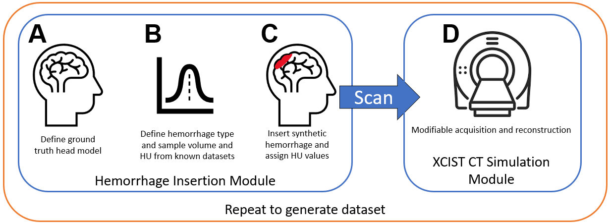
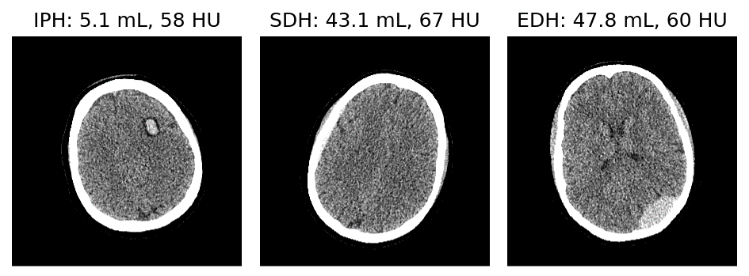
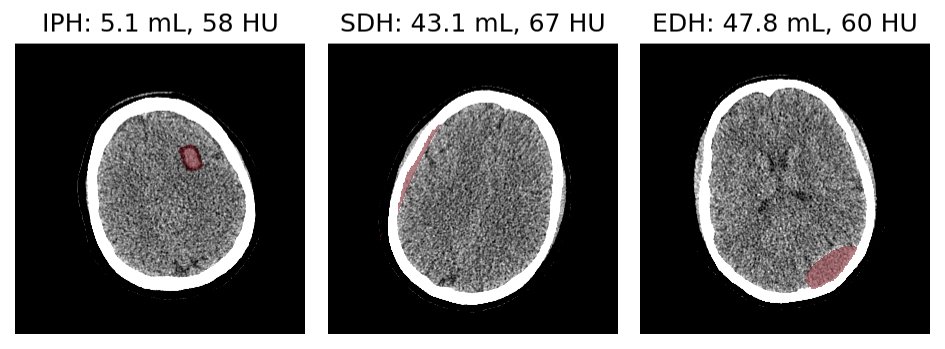

# InSilicoICH: Synthetic Intracranial Hemorrhage Modeling Tools
<a href="https://github.com/DIDSR/InSilicoICH/actions/workflows/python-app.yml"></a>

<p align="center">
  
</p>
<p align="center">
  
</p>

This repository contains tools for generating synthetic non-contrast CT datasets of **intracranial hemorrhage (ICH)**. These datasets are designed to be used for developing, testing, and evaluating AI detection devices.

## The Challenge: Data Scarcity in Medical AI

Intracranial hemorrhage (ICH) is a life-threatening brain bleed requiring immediate medical care. AI-powered Computer-Aided Triage (CADt) devices can accelerate diagnosis by analyzing emergency room CT scans (e.g., [Rapid ICH K221456](https://www.accessdata.fda.gov/scripts/cdrh/cfdocs/cfpmn/pmn.cfm?ID=K221456)).

However, a significant data gap exists for pediatric patients. ICH occurs less frequently in children, leading to a scarcity of annotated pediatric data. An AI model trained predominantly on adults may perform poorly on pediatric scans, potentially delaying time-sensitive treatment for children.

## Our Solution: In Silico Data Generation

To address this data availability challenge, **InSilicoICH** supplements real patient data with *in silico* (computer-simulated) data. By using realistic computational human phantoms and physics-based CT simulations, we can generate perfectly-labeled datasets at a fraction of the cost and time required for manual annotation of real data.

## How It Works

Our simulation pipeline combines several state-of-the-art components:

1.  **Digital Phantoms:** We use the [pediatric and adult XCAT phantom cohort](https://aapm.onlinelibrary.wiley.com/doi/10.1118/1.3480985) and the [MIDA phantom](https://pmc.ncbi.nlm.nih.gov/articles/PMC4406723/), which are detailed, anatomically-realistic models of the human body.
2.  **Hemorrhage Insertion:** A knowledge-based algorithm inserts synthetic hemorrhages into the phantoms. This algorithm controls the placement, shape, volume, and attenuation based on models from [real hemorrhage segmentation data](https://arxiv.org/abs/2308.11298).
3.  **Physics-Based CT Simulation:** The final phantom, complete with the synthetic hemorrhage, is imaged using [**XCIST**](https://github.com/xcist/main), a realistic X-ray CT simulation framework that models the entire image acquisition process.

The tool currently supports three major hemorrhage subtypes:
* **Intraparenchymal (IPH)**
* **Epidural (EDH)**
* **Subdural (SDH)**

## Controllable Parameters

The simulation is highly customizable, allowing you to control dozens of parameters.

* **Patient Characteristics**
    * **Phantom Identifier**: Select a specific phantom from the cohort.
    * **Age**: `6.5 - 38 years` (based on the available phantom library).

* **Lesion Characteristics**
    * **Hemorrhage Type**: `IPH`, `SDH`, `EDH`, or `None`.
    * **Hemorrhage Volume**: `0 - 100 mL`.
    * **Intensity (Attenuation)**: `-30 - 100 HU`.
    * **Mass Effect**: `True` or `False`.
    * **Edema**: `0 - 15 voxels` (IPH only).

* **Acquisition Characteristics**
    * **X-ray Tube Current**: `10 - 1500 mA`.
    * **X-ray Tube Peak Voltage**: `70 - 140 kVp`.
    * **Reconstruction FOV**: `100 - 500 mm`.
    * **Reconstruction Kernel**: e.g., `Soft`, `Standard`, `Bone`.
    * **View Count**: Number of projection views (e.g., `1000`).

* **Output & Metadata**
    * **Random Seed**: For reproducibility.
    * **Image & Mask Locations**: Control where output files are saved.

## Example Simulations

Below are example outputs using the MIDA phantom, showing the simulated CT images and the corresponding ground truth segmentation masks.

**Simulated CT Images with ICH**
<p align="center">
  
</p>

**Ground Truth Segmentation Masks**
<p align="center">
  
</p>

---

## Installation and Setup

### 1. Prerequisites
* Python (tested on versions >=3.11 and <3.13)
* We recommend using a `conda` or `venv` virtual environment.

### 2. Install the Package
Install the package directly from GitHub using `pip`:

```bash
# It is best practice to use a virtual environment
# conda create -n "insilico-env" python=3.11
# conda activate insilico-env

pip install git+https://github.com/DIDSR/InSilicoICH.git
