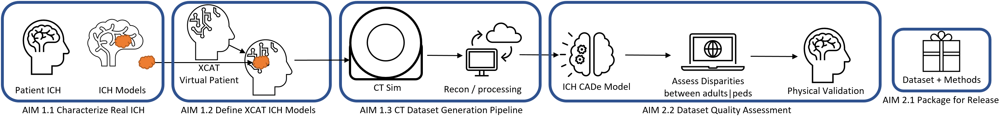
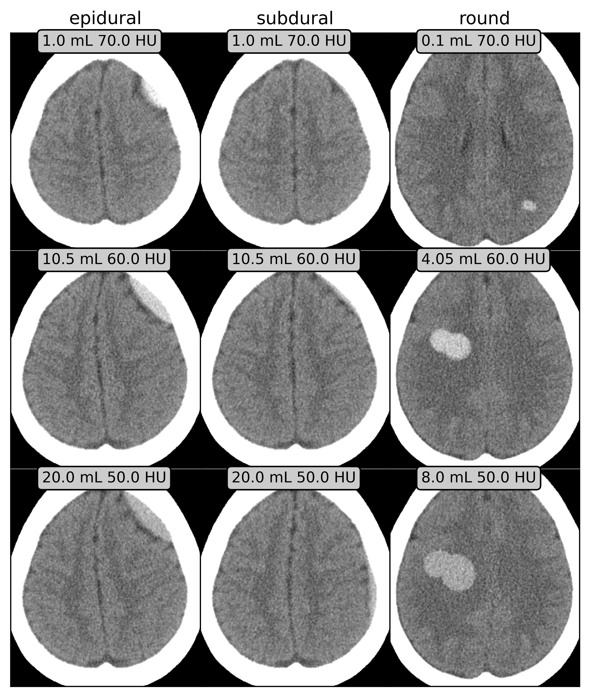
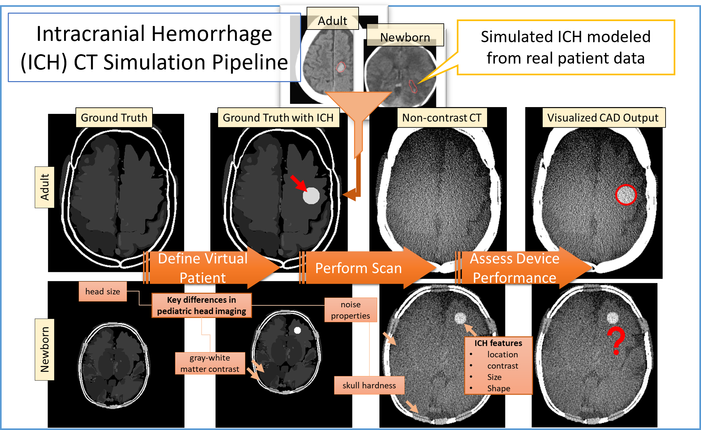
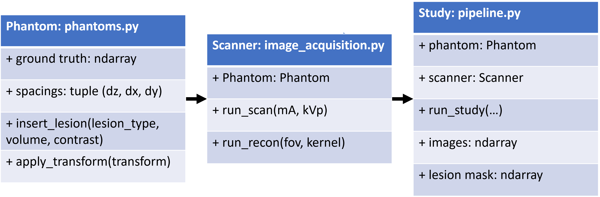

CT Imaging Datasets for Pediatric Device Assessment of Intracranial Hemorrhage
==============================================================================

|tests|

.. |tests| image:: https://github.com/brandonjnelsonFDA/PedSilicoICH/actions/workflows/python-app.yml/badge.svg?branch=master
    :alt: Package Build and Testing Status
    :scale: 100%
    :target: https://github.com/brandonjnelsonFDA/PedSilicoICH/actions/workflows/python-app.yml

**Motivation**
Computer aided triaging (CADt) devices for intracranial hemorrhage (ICH) in the emergency room (e.g. `Rapid ICH K221456 <https://www.accessdata.fda.gov/scripts/cdrh/cfdocs/cfpmn/pmn.cfm?ID=K221456>`_) is one important example where pediatric and adult cases exist in a reading queue where pediatric patients could be disadvantaged by being deprioritized for time sensitive treatment using an adult-trained AI model that extrapolates poorly to pediatric patients. While these AI/ML devices have potential to benefit pediatric patients, there is currently a lack of annotated pediatric data for evaluating the balance of risk and benefits.

**Purpose**
To address data availability challenges, we propose to supplement available pediatric patient computed tomography (CT) datasets with data generated in silico, generated using realistic computational human models and physics-based CT simulations. In silico data generation allows for creating examples with true labels with a fraction of the cost that is needed to label real patient data.

Methods
-------

We have previously combined the `pediatric and adult digital XCAT cohort of phantoms <https://aapm.onlinelibrary.wiley.com/doi/10.1118/1.3480985>`_ with the `XCIST x-ray CT simulation framework <https://iopscience.iop.org/article/10.1088/1361-6560/ac9174/meta>`_ to create realistic CT exams. This preliminary work was in support of investigating the `effectiveness of deep learning denoising algorithms in pediatric patients <https://aapm.onlinelibrary.wiley.com/doi/10.1002/mp.16901>`_.
Dr. Elena Sizikova also built a `pipeline for comparative evaluation of digital mammography AI <https://arxiv.org/abs/2310.18494>`_ using in digital models of the breast and digital mammography (DM) acquisition devices, which will serve as a starting point for this aim. Specifically, we will rely on the XCAT phantom as a digital model of the pediatric brain. We will rely on the XCIST simulator to generate CT images. Specifically, we will vary the following parameters:

**Digital model**: patient size, age, intensity b/w grey and white matter, skull hardness, thickness, and ICH morphology, texture, and location

**Imaging Parameters (CT)**: Radiation dose (MA, KV voltage), slice thickness, reconstruction kernels, reconstruction field of view (FoV).

Installation
------------

.. code-block:: bash

        git clone https://github.com/brandonjnelsonFDA/PedSilicoICH
        pip install -e ./PedSilicoICH

Tested on python 3.11.3

Module Layout
-------------

Repository Contents
-------------------

**notebooks**: for introducing concepts, developing methods, scratch work, and running experiments

*Tutorials*

- `notebooks/tutorials/01_phantoms.ipynb <https://github.com/brandonjnelsonFDA/PedSilicoICH/blob/master/notebooks/01_phantoms.ipynb>`_: introduce working with phantoms and lesion insertion to generate inputs for CT simulations.

- `notebooks/tutorials/02_scanners.ipynb <https://github.com/brandonjnelsonFDA/PedSilicoICH/blob/master/notebooks/02_scanners.ipynb>`_: introduce working with virtual CT scanner for CT imaging simulations.

- `notebooks/tutorials/03_studies.ipynb <https://github.com/brandonjnelsonFDA/PedSilicoICH/blob/master/notebooks/03_studies.ipynb>`_: integrates phantoms and scanners to run virtual imaging studies.

*Project Aims*

- `notebooks/00_basic_eda.ipynb <https://github.com/brandonjnelsonFDA/PedSilicoICH/blob/master/notebooks/00_basic_eda.ipynb>`_: exploratory data analysis of the Hssayeni et 2020 dataset [Aim 1.1]
- `notebooks/03_epidural_subdural_demo.ipynb <https://github.com/brandonjnelsonFDA/PedSilicoICH/blob/master/notebooks/03_epidural_subdural_demo.ipynb>`_: expand simulated lesions to subdural and epidural ICH [Aim 1.2]
- `notebooks/viewing_simulation_results.ipynb <https://github.com/brandonjnelsonFDA/PedSilicoICH/blob/master/notebooks/viewing_simulation_results.ipynb>`_: for viewing the simulation results from CT_dataset_pipeline.py
- `notebooks/IQ_evaluations.ipynb <https://github.com/brandonjnelsonFDA/PedSilicoICH/blob/master/notebooks/IQ_evaluations.ipynb>`_: basic evaluations for quality assurance of XCIST simulations and phantoms

**scripts**: for generating data sets and more production ready

- `CT_dataset_pipeline.py <https://github.com/brandonjnelsonFDA/PedSilicoICH/blob/master/CT_dataset_pipeline.py>`_: used for generating the in silico dataset

Contributing
------------

Our current practice is developing locally by cloning the git repo to your local machine or personal directory and accessing a common dataset. Commits are encouraged to be regularly synced between the local and remote repo. Contributions are welcome from all, though developing on your own branch may be best to avoid merge conflicts, then we can decide on what to merge to the main branch (see `software carpentry on collaborating with git <https://swcarpentry.github.io/git-novice/08-collab.html>`_ for details).

Useful Links
------------

- `REALYSM_PedCT: pedsilico-pilot.ipynb <https://github.com/bnel1201/REALYSM_PedCT/blob/PedSilicoICH-Pilot/pedsilico-pilot.ipynb>`_: CT simulation pipeline that we aim to build off of for this project, in particular this notebook was used to make the pilot data images shown in `Methods`)
- `pediatricIQphantoms: running_simulations.ipynb <https://github.com/bnel1201/pediatricIQphantoms/blob/main/examples/running_simulations.ipynb>`_: examples of using a Python wrapper around the `Michigan Image Reconstruction Toolbox (MIRT) <https://github.com/JeffFessler/mirt>`_ for simple, faster CT simulations
