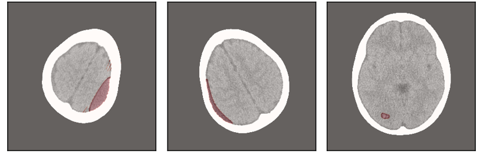
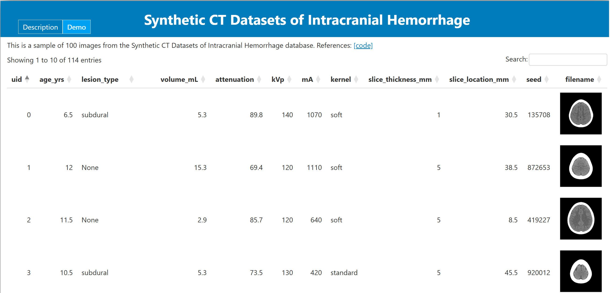
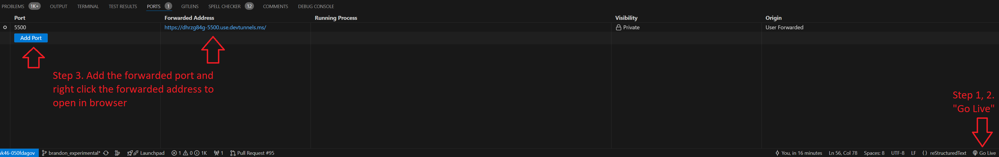

Synthetic Intracranial Hemorrhage Modeling Tools
================================================

|tests|

.. image:: assets/project_aims.png
        :width: 800
        :align: center

.. |tests| image:: https://github.com/brandonjnelsonFDA/PedSilicoICH/actions/workflows/python-app.yml/badge.svg?branch=master
    :alt: Package Build and Testing Status
    :scale: 100%
    :target: https://github.com/brandonjnelsonFDA/PedSilicoICH/actions/workflows/python-app.yml

This repository contains tools for generating synthetic non contrast CT datasets of intracranial hemorrhage (ICH) that can be used for evaluating AI detection devices.

Motivation
----------

Intracranial hemorrhage (ICH) is a bleeding in the brain that can result from trauma or stroke, it can be a life threatening condition that needs immediate care. Computer aided triaging (CADt) devices read CT scans taken in the emergency room to detect ICH (e.g. `Rapid ICH K221456 <https://www.accessdata.fda.gov/scripts/cdrh/cfdocs/cfpmn/pmn.cfm?ID=K221456>`_). Both adults and pediatrics can present with ICH, but with different frequencies. Due to this difference in frequency, pediatric patients could be disadvantaged by being deprioritized for time sensitive treatment using an adult-trained AI model that poorly extrapolates to pediatrics. While these AI/ML devices have potential to benefit pediatric patients, there is currently a lack of annotated pediatric data for evaluating the balance of risk and benefits.

Purpose
-------

To address data availability challenges, we propose to supplement available pediatric patient computed tomography (CT) datasets with data generated in silico, generated using realistic computational human models and physics-based CT simulations. In silico data generation allows for creating examples with true labels with a fraction of the cost that is needed to label real patient data.

Methods
-------

We have previously combined the `pediatric and adult digital XCAT cohort of phantoms <https://aapm.onlinelibrary.wiley.com/doi/10.1118/1.3480985>`_ with the `XCIST x-ray CT simulation framework <https://iopscience.iop.org/article/10.1088/1361-6560/ac9174/meta>`_ to create realistic CT exams. This preliminary work was in support of investigating the `effectiveness of deep learning denoising algorithms in pediatric patients <https://aapm.onlinelibrary.wiley.com/doi/10.1002/mp.16901>`_.

In this work, synthetic hemorrhages are inserted into head and neck phantoms based on MR templates and atlases. Presently, three hemorrhage subtypes are supported: intraparenchymal (IPH), epidural (EDH), and subdural (SDH). A knowledge-based algorithm is used to guide the placement and shape of the synthetic hemorrhages, using volume and attenuation parameters modeled from `real hemorrhages obtained in a segmentation dataset <https://arxiv.org/abs/2308.11298>`_. Appropriate Hounsfield units can be assigned to each segmented region of the phantom, such as the gray and white matter, bone, CSF, and the hemorrhage. As with previous work, `XCIST <https://github.com/xcist/main>`_ is used to create realistic simulated CT exams with included synthetic hemorrhages.

The knowledge-based algorithm allows the following parameters to be controlled with suggested ranges and units, some limits on acquisition parameters are scanner dependent, see `XCIST <https://github.com/xcist/main/blob/master/gecatsim/cfg/Scanner_Default.cfg>`_ for further details:

+----------------------------+------------------------------------------------------+-------------------------------------------+---------------------------------+
|                            |                                                      |                                           |                                 |
| Patient Characteristics    | Lesion Characteristics                               | Acquisition Characteristics               | Misc./Output Data               |
+============================+======================================================+===========================================+=================================+
|                            |                                                      |                                           |                                 |
| Identifier                 | Intensity [-30 - 100 HU]                             | X-ray tube current [10-1500 mA]           | Seed to reproduce               |
+----------------------------+------------------------------------------------------+-------------------------------------------+---------------------------------+
|                            |                                                      |                                           |                                 |
| `Age [6.5-38 years]`_      | Hemorrhage volume [0-100 mL] and slice coverage      | X-ray tube peak voltage [70-140 kVp]      | Image file location             |
+----------------------------+------------------------------------------------------+-------------------------------------------+---------------------------------+
|                            |                                                      |                                           |                                 |
|                            | Hemorrhage type [IPH, SDH, EDH, None]                | CT acquisition view count [1000 views]    | Mask file directory location    |
+----------------------------+------------------------------------------------------+-------------------------------------------+---------------------------------+
|                            |                                                      |                                           |                                 |
|                            | Mass effect [True, False]                            | Reconstruction FOV (FOV) [100 - 500 mm]   | Hemorrhage slice number(s)      |
+----------------------------+------------------------------------------------------+-------------------------------------------+---------------------------------+
|                            |                                                      |                                           |                                 |
|                            | Edema [0-15 voxels] (IPH only)                       | `Reconstruction kernel`_                  |                                 |
+----------------------------+------------------------------------------------------+-------------------------------------------+---------------------------------+

.. _Age [6.5-38 years]: https://github.com/DIDSR/PedSilicoICH/blob/872ee48dd42fb13b9d8a759feb1dac8f0d73a079/src/pedsilicoICH/ground_truth_definition/phantoms.py#L567-L568
.. _Reconstruction kernel: https://github.com/xcist/main/blob/master/gecatsim/cfg/Recon_Default.cfg#L9-L11

Below are example simulation outputs:

.. image:: assets/montage.png
        :width: 800
        :align: center

Note, the CT simulations also include methods for readily extracting ground truth segmentation masks of the inserted ICH for generating segmentation datasets.

Installation
------------

.. code-block:: bash

        pip install git+https://github.com/DIDSR/PedSilicoICH.git

Tested on python 3.11.3

Usage
-----

The synthetic data generation and image simulation tools included in this repo can be used either programmatically by importing into Python scripts as a Package or via command line interface (CLI)

**Programmatic Usage**

See the included `jupyter notebooks <notebooks/tutorials>`_ for example programmatic usage

**Command Line Usage**

After `pip` installing, 2 command line programs will be available to:

1. `recruit` which creates a csv of virtual patients to be imaged when given an `inclusion_criteria.toml <example_inclusion_criteria.toml>`_ file which specifies the range and distribution of patient, disease, and acquisition parameters to sample from when recruiting a virtual imaging trial

.. code-block:: bash

        generate example_inclusion_criteria.toml
        > default_study/default_study.csv

The output of generate is a `csv` file, here `default_study.csv <default_study/default_study.csv>`_ which specifies explicitly which patients and scans to run, where each row is a preview of the unique scan to be performed. This file can be made manually or edited.

See `recruit --help` for more details on how to run the program and `example_inclusion_criteria.toml <example_inclusion_criteria.toml>`_ for more details on the choosing parameter ranges to sample.

2. `generate` takes the recruited patient `.csv` list and runs the scans in the list.

.. code-block:: bash

        generate default_study/default_study.csv

See `generate --help` help for more details

Virtual patient recruitment and scanning can be chained together using the pipe `|` operator like so

.. code-block:: bash

        recruit example_inclusion_criteria.toml | generate

Images and any hemorrhage segmentation masks will be saved in DICOM format in subdirectories under the selected `output_directory` specified in the study `input csv <default_study/default_study.csv>`_

The output `default_study/default_study.csv` can then be used to reproduce the dataset again later using `generate`

View a Sample Dataset (local demo)
----------------------------------

Based off of `the S-Synth Demo <https://github.com/DIDSR/ssynth-release>`_

A sample dataset is viewable as a demo, located in docs/index.html. To serve this website locally do the following:

1. install the `VS Code Live Server Extension <https://marketplace.visualstudio.com/items?itemName=ritwickdey.LiveServer>`_
2. Open `index.html <docs/index.html>`_ and click the `Go Live` button at the far lower right corner of VS Code that should appear when an html file is open. 
3. After selecting `Go`Under the `PORTS` tab of the VS Code terminal, add the port number that popped up after going live (5500 is default), then right click the forwarded address
4. Click on the `docs` folder containing the demo and the website should load

Module Layout
-------------

.. image:: assets/pedsilico_class_diagram.png
        :width: 800
        :align: center

Repository Contents
-------------------

**notebooks**: for introducing concepts, developing methods, scratch work, and running experiments

*Tutorials*

- `notebooks/01_phantoms.ipynb <notebooks/01_phantoms.ipynb>`_: introduce working with phantoms and lesion insertion to generate inputs for CT simulations.

- `notebooks/02_scanners.ipynb <notebooks/02_scanners.ipynb>`_: introduce working with virtual CT scanner for CT imaging simulations.

- `notebooks/03_studies.ipynb <notebooks/03_studies.ipynb>`_: integrates phantoms and scanners to run virtual imaging studies.

See Also
--------

- `PedSilicoAbdomen <https://github.com/DIDSR/PedSilicoAbdomen>`_ for generating synthetic abdominal non contrast CT datasets
- `PedSilicoLVO <https://github.com/brandonjnelsonFDA/PedSilicoLVO>`_ for generating synthetic large vessel occlusion (LVO) non contrast CT datasets
- `Virtual Imaging Tools (VITools) <https://github.com/DIDsr/vitools>`_ tools for running virtual imaging trials including image acquisition frameworks
- `Wait time assessments for ICH CADt VIT <https://github.com/brandonjnelsonFDA/ICH-CADt-VIT>`_

Disclaimer
----------

This software and documentation (the "Software") were developed at the **US Food and Drug Administration** (FDA) by employees of the Federal Government in the course of their official duties. Pursuant to Title 17, Section 105 of the United States Code, this work is not subject to copyright protection and is in the public domain. Permission is hereby granted, free of charge, to any person obtaining a copy of the Software, to deal in the Software without restriction, including without limitation the rights to use, copy, modify, merge, publish, distribute, sublicense, or sell copies of the Software or derivatives, and to permit persons to whom the Software is furnished to do so. FDA assumes no responsibility whatsoever for use by other parties of the Software, its source code, documentation or compiled executables, and makes no guarantees, expressed or implied, about its quality, reliability, or any other characteristic. Further, use of this code in no way implies endorsement by the FDA or confers any advantage in regulatory decisions. Although this software can be redistributed and/or modified freely, we ask that any derivative works bear some notice that they are derived from it, and any modified versions bear some notice that they have been modified.
