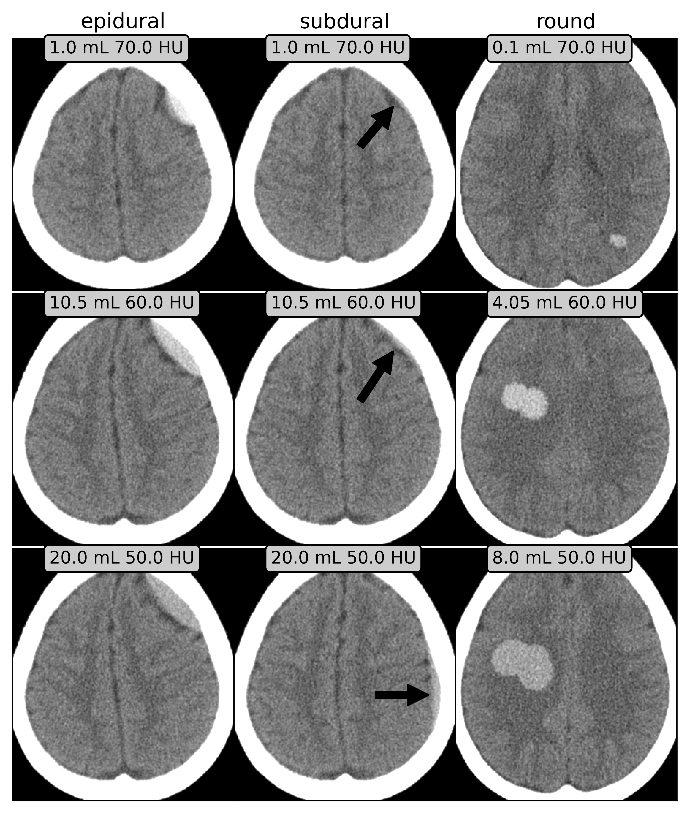

# Synthetic CT Datasets of Intracranial Hemorrhage

This repository contains tools for generating synthetic non contrast CT datasets of intracranial hemorrhage (ICH)

- **Paper:**
- **Data:**
- **Code:** <https://github.com/DIDSR/PedSilicoICH>
- **Demo:** 

## Motivation

To address data availability challenges, we propose to supplement available pediatric patient computed tomography (CT) datasets with data generated in silico, generated using realistic computational human models and physics-based CT simulations. In silico data generation allows for creating examples with true labels with a fraction of the cost that is needed to label real patient data.

### Motivation for Pediatric Evaluation

Computer aided triaging (CADt) devices for intracranial hemorrhage (ICH) in the emergency room (e.g. Rapid ICH K221456) is one important example where pediatric and adult cases exist in a reading queue where pediatric patients could be disadvantaged by being deprioritized for time sensitive treatment using an adult-trained AI model that extrapolates poorly to pediatric patients. While these AI/ML devices have potential to benefit pediatric patients, there is currently a lack of annotated pediatric data for evaluating the balance of risk and benefits.

## Simulation Parameters

Summary table

| Patient Characteristics | Lesion Characteristics                          | Acquisition Characteristics            | Misc./Output Data            |
|-------------------------|-------------------------------------------------|----------------------------------------|------------------------------|
| Identifier              | Intensity [HU]                                  | X-ray tube current [mA]                | Seed to reproduce            |
| Age (atlas-based)       | Hematoma volume [mL] and slice coverage         | X-ray tube peak voltage [kVp]          | Image file location          |
|                         | Hemorrhage type                                 | CT acquisition view count [views]      | Mask file directory location |
|                         | Mass effect strength (currently IPH/round only) | Reconstructed field of view (FoV) [mm] | Hemorrhage slice number(s)   |
|                         | Edema [voxels] (IPH/round only)                 | Reconstruction kernel                  |                              |
